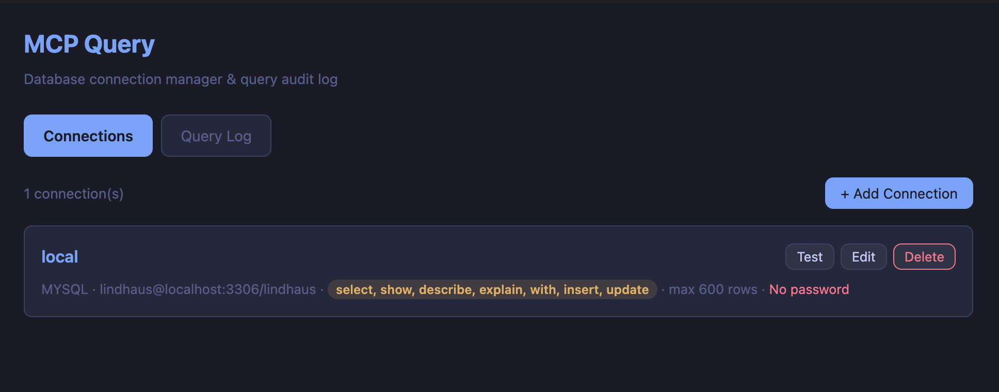

# MCP Query

MCP server locale per eseguire query database da Claude Code in modo sicuro. Le credenziali sono nel Portachiavi Apple, ogni connessione ha un livello di permessi che controlla quali operazioni sono consentite, e tutte le query vengono loggate per audit.



## Requisiti

- Python >= 3.10
- [uv](https://docs.astral.sh/uv/) (package manager)
- macOS (per il Portachiavi Apple)

## Installazione

```bash
# Clona o entra nella directory del progetto
cd mcp-query

# Installa dipendenze
uv sync
```

## Setup

### 1. Configura le connessioni

Copia il file di esempio e personalizzalo:

```bash
cp config.example.yaml ~/.mcp-query/config.yaml
```

Modifica `~/.mcp-query/config.yaml`:

```yaml
defaults:
  max_rows: 500           # Limite righe per SELECT
  permissions: read       # Permesso default
  log_retention_days: 30  # Retention log in giorni

connections:
  local-mysql:
    driver: mysql           # mysql | pgsql | sqlite
    host: localhost
    port: 3306
    database: myapp
    user: root
    permissions: write      # preset: select + insert/update/delete
    max_rows: 1000

  staging-api:
    driver: mysql
    host: staging-db.example.com
    port: 3306
    database: api
    user: developer
    permissions: [select, insert]  # granulare: solo queste operazioni

  prod-db:
    driver: pgsql
    host: db.example.com
    port: 5432
    database: analytics
    user: readonly_user
    permissions: read       # preset: solo select

  local-sqlite:
    driver: sqlite
    database: /path/to/database.sqlite
    permissions: admin      # preset: tutte le operazioni
```

### 2. Imposta le password

Le password vengono salvate nel Portachiavi Apple, mai su file.

**Da terminale:**

```bash
uv run mcp-query set-password local-mysql
# Ti chiede la password in modo interattivo
```

**Dalla Web UI:**

```bash
uv run mcp-query ui
# Si apre http://localhost:9847 nel browser
```

Dalla UI puoi aggiungere connessioni, impostare password, testare la connettivita' e consultare i log.

### 3. Registra in Claude Code

```bash
# Globale (disponibile in tutti i progetti)
claude mcp add --scope user db -- \
  uv run --directory /path/to/mcp-query mcp-query serve

# Solo nel progetto corrente
claude mcp add db -- \
  uv run --directory /path/to/mcp-query mcp-query serve
```

Sostituisci `/path/to/mcp-query` con il path reale del progetto. Da quel momento Claude Code avra' accesso ai tools database.

Per indicare a Claude quale connessione usare automaticamente in un progetto, aggiungi nel `CLAUDE.md` del progetto:

```markdown
## Database
Per le query al database usare il tool MCP `query` con connessione `nome-connessione`.
```

## Comandi CLI

| Comando | Descrizione |
|---------|-------------|
| `mcp-query serve` | Avvia il server MCP (usato da Claude Code via stdio) |
| `mcp-query ui` | Apre la Web UI di gestione nel browser |
| `mcp-query list` | Mostra le connessioni configurate |
| `mcp-query set-password <nome>` | Salva la password nel Portachiavi |
| `mcp-query logs` | Mostra le ultime query dal log |
| `mcp-query logs -c <nome> -n 50` | Filtra per connessione, ultime 50 |

## Tools MCP

Questi sono i tools che Claude Code puo' chiamare:

### `list_connections`

Mostra tutte le connessioni configurate con driver, database e livello permessi.

### `list_tables`

```
connection: "local-mysql"
```

Lista le tabelle del database.

### `describe_table`

```
connection: "local-mysql"
table: "users"
```

Mostra la struttura della tabella (colonne, tipi, chiavi).

### `query`

```
connection: "local-mysql"
sql: "SELECT * FROM users WHERE active = 1"
```

Esegue una query SQL. Il tipo di query viene rilevato automaticamente e confrontato con i permessi della connessione. Se il permesso e' insufficiente, la query viene bloccata.

### `query_log`

```
connection: ""     # vuoto = tutte
limit: 20
```

Mostra le ultime query eseguite dal log di audit.

## Permessi

I permessi si configurano in due modi:

### Preset (shorthand)

| Preset | Operazioni consentite |
|--------|----------------------|
| `read` | select, show, describe, explain |
| `write` | read + insert, update, delete |
| `admin` | write + create, alter, drop, truncate, grant, revoke |

```yaml
permissions: read
```

### Granulare (lista esplicita)

Puoi specificare esattamente quali operazioni sono consentite:

```yaml
# Solo SELECT e INSERT, niente UPDATE/DELETE
permissions: [select, insert]

# SELECT con possibilita' di creare tabelle
permissions: [select, describe, create]

# Tutto tranne DROP
permissions: [select, show, describe, explain, insert, update, delete, create, alter]
```

Operazioni disponibili: `select`, `show`, `describe`, `explain`, `insert`, `update`, `delete`, `replace`, `create`, `alter`, `drop`, `truncate`, `grant`, `revoke`, `rename`.

La Web UI fornisce checkbox raggruppati per categoria (Read/Write/DDL) con preset rapidi.

### Protezioni

- **Multi-statement bloccati**: query con piu' di un `;` vengono rifiutate
- **LIMIT automatico**: i SELECT senza LIMIT ricevono automaticamente il `max_rows` della connessione
- **Query sconosciute bloccate**: solo i tipi di statement esplicitamente mappati sono consentiti

## Audit Log

Ogni query eseguita (incluse quelle bloccate) viene salvata in `~/.mcp-query/logs/queries-YYYY-MM-DD.jsonl`.

Formato di ogni riga:

```json
{
  "ts": "2026-03-31T14:22:05.123456+00:00",
  "connection": "local-mysql",
  "sql": "SELECT * FROM users WHERE id = 1",
  "query_type": "SELECT",
  "permission": "read",
  "status": "ok",
  "rows_affected": 1,
  "execution_ms": 12.5,
  "error": null
}
```

I valori di `status` sono:
- `ok` - query eseguita con successo
- `denied` - bloccata dai permessi
- `error` - errore durante l'esecuzione

I log vengono cancellati automaticamente dopo `log_retention_days` giorni (default: 30).

## Web UI

```bash
uv run mcp-query ui
```

Apre `http://localhost:9847` con:

- **Connections** - gestisci connessioni (aggiungi, modifica, elimina), imposta password, testa la connettivita'
- **Query Log** - consulta i log con filtri per connessione

Opzioni:

```bash
uv run mcp-query ui --port 8080        # Porta custom
uv run mcp-query ui --no-browser       # Non aprire il browser
```

## Struttura file

```
~/.mcp-query/
  config.yaml                    # Configurazione connessioni
  logs/
    queries-2026-03-31.jsonl     # Log giornaliero
```

```
mcp-query/
  pyproject.toml
  src/mcp_query/
    __main__.py                  # CLI entry point
    server.py                    # MCP server + tools
    config.py                    # Config YAML + Keychain
    db.py                        # Connessioni + query + permessi
    audit.py                     # Logging JSONL
    ui.py                        # Web UI
```

## Database supportati

| Driver | Libreria | Note |
|--------|----------|------|
| `mysql` | PyMySQL | MySQL / MariaDB |
| `pgsql` | psycopg2 | PostgreSQL |
| `sqlite` | sqlite3 (built-in) | Nessuna password necessaria |
